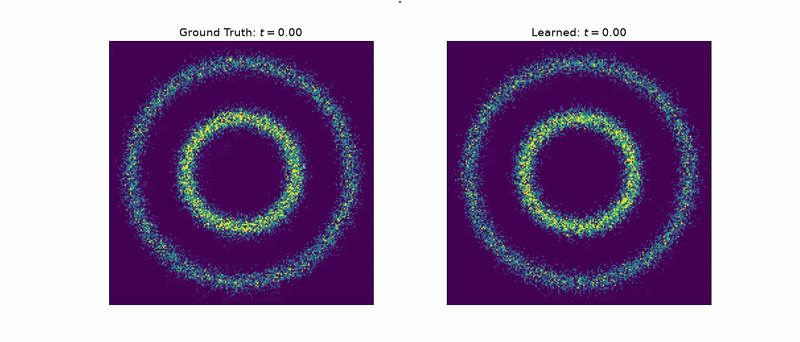

# Hi Everyone! This is Krrish

## About me

Builder still figuring out his path. **M.Sc. Statistics and Data Science** (LMU Munich) and **M.Sc. Management and Technology** (TU Munich). I want to work at the cutting edge and eventually build my own organization to solve pressing fundamental problems.

*Okay, this is me programming*, mostly with agents, and sometimes with whatever they hand back.

More on [my website](https://kkrrish.tech/).

## What I'm working on

1. **Active learning** (Prof. Schetze): comparing uncertainty measures to choose training data so models learn more from less.
2. **Indic encoders**: ModernBERT-style models for **Indian languages**. Distilled Hindi checkpoints on [Hugging Face](https://huggingface.co/kkkamur07); extending the line, aiming to finish by June.
3. **Greek Foundation**: end-to-end ML pipeline to transcribe **Byzantine Greek** manuscripts (segmentation, extraction, deployment), along the lines of eScriptorium for LMU.

## What I'm learning

Deep generative models (VAEs to Diffusion), parallel computing, and **Tiny Torch**: a from-scratch tensor library to see how PyTorch and JAX really work.

More on [GitHub](https://github.com/kkkamur07?tab=repositories).
